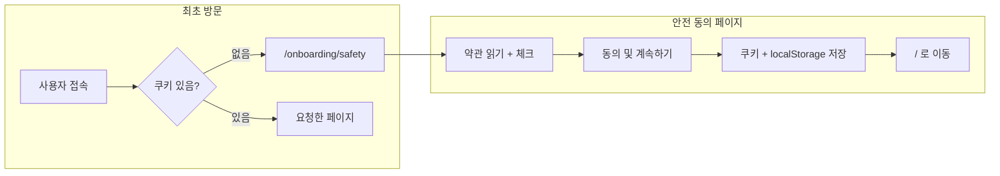

# ON-00: 안전 동의 (Safety Consent) MVP 구현 계획

> **상태**: 구현 완료 (TODO 2.1 완료 처리됨)  
> **관리 위치**: 이 문서는 `docs/implementation-plans/`에서 관리됩니다.

---

## 1. 요구사항 정리

| 출처 | 내용 |
|------|------|
| PRD 3.1 [Step 0] | 앱 진입 시 고강도 훈련 위험성·책임 소재에 대한 [동의 서약] 필수. **Skip 불가** |
| TODO 2.1 | safety 페이지, 경고/헤드라인, 스크롤 약관, 체크박스, [시작하기] 버튼, 로컬 스토리지 저장, 미동의 시 진입 차단 |
| Definition of Done | Safety: 시작 전 안전 동의 필수 구현 |
| userflow.mermaid | 비로그인/로그인 모두 "안전 동의 완료?" → 아니오면 안전 동의 화면 |

**동의 후 이동 경로**: MVP에서는 다음 온보딩 단계(ON-01 홈짐 선택)가 미구현이므로, 동의 후 **홈(`/`)으로 리다이렉트**하는 것으로 처리. 추후 ON-01 구현 시 `/onboarding/gym-select`로 변경 가능하도록 상수로 분리 (`constants/onboarding.ts` → `SAFETY_CONSENT_REDIRECT_PATH`).

---

## 2. 아키텍처 및 데이터 흐름

- **진입 차단**: 미들웨어에서 **쿠키**로 동의 여부 판단. (localStorage는 서버/미들웨어에서 접근 불가이므로 쿠키 병행)
- **저장소**
  - **쿠키** `griplab_safety_consent`: 미들웨어 리다이렉트용, 장기 유효(예: 1년)
  - **localStorage** (선택): 클라이언트에서 동의 상태 재확인용. TODO에서 명시했으므로 구현

---

## 3. 구현 범위

### 3.1 라우트 및 레이아웃

- **파일**: `app/onboarding/safety/page.tsx` (신규)
- **경로**: `/onboarding/safety`
- **레이아웃**: 디자인 레퍼런스는 풀스크린(상단 네비 없음). 현재 루트 레이아웃에 `Navbar`가 있으므로, **온보딩 경로에서는 Navbar 비노출** 처리 필요.
  - **방안**: `Navbar`를 감싸는 클라이언트 컴포넌트에서 `usePathname()`으로 `pathname.startsWith('/onboarding')`일 때 `null` 반환. (기존 `app/layout.tsx` 구조 유지, `components/Navbar.tsx` 또는 래퍼 수정)

### 3.2 안전 동의 페이지 UI (디자인 레퍼런스 반영)

참조: [docs/design-refs/01_safety_consent.html](../design-refs/01_safety_consent.html)

| 요소 | 구현 내용 |
|------|------------|
| 상단 히어로 | 경고 아이콘(lucide-react `AlertTriangle`), 제목 "훈련 안전 수칙", 부제 "주의 깊게 읽어주세요". 배경 이미지 또는 그라데이션(디자인과 유사하게) |
| 본문 | "약관 및 면책 조항" 소제목, **스크롤 가능한** 약관 텍스트 박스 (디자인 5개 조항: 위험의 감수, 의학적 상담, AI 분석 면책 고지, 데이터 사용, 책임의 제한) |
| 체크박스 | "위험을 인지했습니다." / "위의 안전 약관을 읽었으며 이에 동의합니다." (체크 시에만 버튼 활성화) |
| 버튼 | "동의 및 계속하기" (또는 "시작하기"). 체크 전 비활성화 |

- **스타일**: Tailwind v4 + `app/globals.css` 기존 변수 활용. 디자인의 primary `#1fe7f9`는 필요 시 해당 페이지만 인라인 또는 로컬 클래스로 적용 가능.
- **UI 컴포넌트**: shadcn **Checkbox** 미설치 시 `pnpx shadcn@latest add checkbox`로 추가. 버튼은 기존 `components/ui/button.tsx` 사용.

### 3.3 동의 상태 저장 및 리다이렉트

- **클라이언트 (페이지 컴포넌트)**
  - "동의 및 계속하기" 클릭 시:
    1. **쿠키 설정**: `griplab_safety_consent=true` (또는 `1`), `path=/`, `max-age=31536000` (1년). 브라우저 쿠키 API 또는 Server Action으로 설정.
    2. **localStorage**: 키 `griplab_safety_consent`에 동의 값 저장 (예: `"true"`).
    3. **리다이렉트**: `router.push('/')` 또는 `redirect('/')`.
  - 쿠키 설정을 **Server Action**으로 두면 `cookies().set()`로 일관된 옵션 적용 가능. (클라이언트에서만 설정해도 동작 가능)
- **상수**: 동의 후 이동 경로를 `constants/onboarding.ts` 등에 `SAFETY_CONSENT_REDIRECT_PATH = '/'`로 두고, 추후 `/onboarding/gym-select`로 변경 용이하게 처리.

### 3.4 미동의 시 앱 진입 차단 (미들웨어)

- **파일**: `middleware.ts`
- **로직**:
  - 다음 경로는 **동의 체크 제외**: `/onboarding/safety`, `/sign-in`, `/sign-up`, `/api/**`, 정적 파일 등 (기존 matcher 유지).
  - 그 외 모든 경로에서 `griplab_safety_consent` 쿠키 없으면 → `NextResponse.redirect('/onboarding/safety')`.
- **Clerk과의 순서**: 기존 `clerkMiddleware` 안에서 또는 이후에 쿠키 체크. 인증 필요 없는 페이지도 동의는 필요하므로, **동의 체크를 먼저** 적용하고, 그 다음 Clerk 공개 라우트/보호 라우트 처리.

---

## 4. 파일별 작업 요약

| # | 작업 | 파일/위치 |
|---|------|------------|
| 1 | 상수 정의 (쿠키 키, 리다이렉트 경로) | `constants/onboarding.ts` (신규) 또는 `lib/constants.ts` |
| 2 | 안전 동의 페이지 (UI + 체크박스 + 버튼 + 저장 + 리다이렉트) | `app/onboarding/safety/page.tsx` (신규, `'use client'`) |
| 3 | 약관 문구 상수/객체 (5개 조항 텍스트) | 동일 파일 또는 `constants/safety-consent.ts` (가독성용) |
| 4 | 쿠키 설정 Server Action (선택) | `actions/onboarding.ts` (신규) 또는 기존 actions 폴더 |
| 5 | 미들웨어에 동의 쿠키 체크 및 리다이렉트 추가 | `middleware.ts` |
| 6 | 온보딩 경로에서 Navbar 숨김 | `components/Navbar.tsx` 또는 Navbar 래퍼(클라이언트) |
| 7 | shadcn Checkbox 설치 | `pnpx shadcn@latest add checkbox` → `components/ui/checkbox.tsx` |

---

## 5. 기술적 유의사항

- **미들웨어**: 쿠키는 `request.cookies.get('griplab_safety_consent')`로 읽음. Next.js 미들웨어에서 `NextResponse.redirect()` 반환 시 해당 요청은 앱 라우트로 가지 않음.
- **SSR/클라이언트**: 안전 동의 페이지는 체크박스·버튼·리다이렉트가 필요하므로 **Client Component** (`'use client'`). 약관 텍스트는 정적이므로 서버에서 내려도 되고, 한 파일에 두어도 됨.
- **접근성**: 체크박스에 `label` 연결, 버튼에 `disabled`와 스크린 리더 설명 유지.
- **테스트**: TODO 11.1 "안전 동의 필수 확인 (Skip 불가)" — 동의 전 `/` 접근 시 `/onboarding/safety`로 리다이렉트되는지, 동의 후 `/` 접근 가능한지 확인.

---

## 6. 구현 순서 제안

1. **상수 및 약관 텍스트** 정리 (쿠키 키, 리다이렉트 경로, 5개 조항)
2. **shadcn Checkbox** 설치
3. **미들웨어** 수정 — 동의 쿠키 없으면 `/onboarding/safety`로 리다이렉트 (허용 경로 목록 명확히)
4. **안전 동의 페이지** 구현 — 레이아웃·히어로·스크롤 약관·체크박스·버튼·클릭 시 쿠키+localStorage+리다이렉트
5. **쿠키 설정**: 클라이언트에서 `document.cookie`로 설정하거나, Server Action에서 `cookies().set()` 호출
6. **Navbar** — `/onboarding` 일 때 숨김 처리
7. **수동 검증** — 최초 접속 → safety 표시, 동의 후 → 홈 진입, 쿠키 삭제 후 재접속 → 다시 safety

이 순서로 진행하면 ON-00 MVP를 PRD·TODO·디자인 레퍼런스에 맞게 구현할 수 있습니다.
