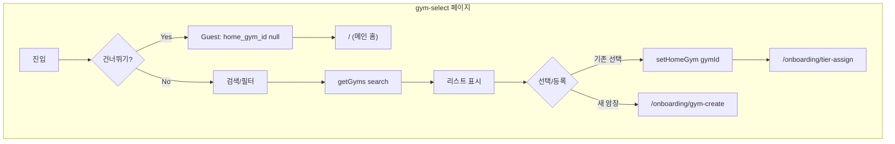

# ON-01: 홈짐 선택 (Gym Selection) MVP 구현 계획

> **상태**: 구현 완료 (TODO 2.2)  
> **관리 위치**: 이 문서는 `docs/implementation-plans/`에서 관리됩니다.

---

## 1. 요구사항 정리

| 출처 | 내용 |
|------|------|
| PRD 3.1 Step 1 | Guest Option: [건너뛰고 앱 둘러보기] → Guest 모드, 메인 홈으로 이동. Official/Community 검색. Create: [새 암장 등록] → 색상-티어 매핑 후 저장. |
| TODO 2.2 | app/onboarding/gym-select/page.tsx, [건너뛰고 둘러보기], 암장 검색창, 암장 리스트(공식/커뮤니티 뱃지), [+ 새 암장 등록]. GymSearchList, getGyms(search?), createGym(data). |
| userflow.mermaid Step 1 | 건너뛰기 → Guest (home_gym_id = null). Official/Community/Create → 선택 완료 후 Step 2(티어 배정)로. |
| Definition of Done | Onboarding: 홈짐 검색/등록 구현. |

**데이터**: `gyms` (id, name, is_official, created_by, created_at), `gym_grade_scales` (gym_id, …). Clerk 동기화용 `users` 테이블에 `home_gym_id` 컬럼 추가(마이그레이션). 선택 완료 시 로그인 사용자 `users.home_gym_id` 저장.

---

## 2. 아키텍처 및 데이터 흐름

- **건너뛰기**: `router.push('/')`. Guest는 이후 `home_gym_id === null`로 판단.
- **선택 완료**: Server Action `setHomeGym(gymId)` → `users.home_gym_id` 업데이트 후 `/onboarding/tier-assign` 이동.
- **새 암장 등록**: ON-02로 이동. ON-01에서는 버튼만 `/onboarding/gym-create` 링크.

---

## 3. 구현 범위 (TODO 2.2 기준)

### 3.1 라우트 및 페이지

- **파일**: `app/onboarding/gym-select/page.tsx`
- **경로**: `/onboarding/gym-select`
- **디자인 레퍼런스**: docs/design-refs/02_gym_select.html

### 3.2 UI 요소

| 요소 | 구현 내용 |
|------|------------|
| 상단 | "홈짐 선택", [건너뛰고 둘러보기] → `/` |
| 검색 | 실시간 검색창, getGyms(search) 호출 |
| 필터 | 전체 / 공식 / 커뮤니티 칩 (클라이언트 필터) |
| 리스트 | GymSearchList: 이름, is_official 뱃지, 라디오 선택 |
| 하단 | [다음](선택 시), [+ 새 암장 등록] → `/onboarding/gym-create` |

### 3.3 Server Actions

- **actions/gyms.ts**: getGyms(search?), createGym(data)
- **actions/profiles.ts**: setHomeGym(gymId) — users 테이블 home_gym_id 업데이트 (clerk_id 기준)

### 3.4 컴포넌트

- **components/onboarding/GymSearchList.tsx**: gyms, selectedId, onSelect, loading, error. is_official 뱃지.

### 3.5 마이그레이션

- **supabase/migrations/20250203120000_add_users_home_gym_id.sql**: `users.home_gym_id` UUID FK to gyms.

---

## 4. 파일별 작업 요약

| # | 작업 | 파일/위치 |
|---|------|------------|
| 1 | getGyms, createGym | actions/gyms.ts |
| 2 | setHomeGym (users.home_gym_id) | actions/profiles.ts |
| 3 | gym-select 페이지 | app/onboarding/gym-select/page.tsx |
| 4 | GymSearchList | components/onboarding/GymSearchList.tsx |
| 5 | users.home_gym_id 컬럼 | supabase/migrations/20250203120000_add_users_home_gym_id.sql |

---

## 5. 기술적 유의사항

- **DB**: gyms select 전체 허용, insert는 authenticated. setHomeGym은 service role로 users 업데이트(클릭 시 clerk_id로 식별).
- **Guest**: 건너뛰기는 클라이언트에서 바로 `/` 이동. home_gym_id null로 Guest 판단.
- **ON-02**: "새 암장 등록"은 ON-02에서 구현. ON-01에서는 버튼만 `/onboarding/gym-create` 링크.

---

## 6. 구현 순서

1. actions/gyms.ts (getGyms, createGym)
2. 마이그레이션 users.home_gym_id, actions/profiles.ts (setHomeGym)
3. GymSearchList.tsx
4. app/onboarding/gym-select/page.tsx
