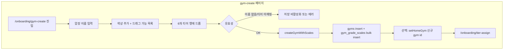

# ON-02: 커스텀 암장 등록 (Create Gym) 구현 계획

> **상태**: 구현 완료 (TODO 2.3)
> **관리 위치**: 이 문서는 `docs/implementation-plans/`에서 관리됩니다.

---

## 현재 구현 완료 요약

| 구분                                     | 상태   | 비고                                                                                            |
| ---------------------------------------- | ------ | ----------------------------------------------------------------------------------------------- |
| **actions/gyms.ts**                      | 완료   | `createGymWithScales(gymData, scales)` 구현. 이름 검증, gym insert, scales bulk insert          |
| **app/onboarding/gym-create/page.tsx**   | 완료   | 이름 입력, GymCreator, [저장하기], createGymWithScales → setHomeGym → `/onboarding/tier-assign` |
| **components/onboarding/GymCreator.tsx** | 완료   | dnd-kit, 색상 추가( color + hex Input ), 6티어 행 + TierDropZone, 티어별 다이얼로그 색상 추가   |
| **dnd-kit**                              | 설치됨 | `@dnd-kit/core`, `@dnd-kit/utilities`                                                           |
| **constants/onboarding**                 | 있음   | `DEFAULT_GYM_COLORS` — GymCreator 초기 색상                                                     |

핵심 플로우(이름 입력 → 색상·티어 매핑 → 저장 → tier-assign) 동작 완료.

### 보완 항목 (선택 적용)

- **디자인**: 03_gym_create.html 대조 — 암장 이름 필드 우측 edit 아이콘, 빈 드롭존에 drag_indicator 아이콘.
- **UX**: 제출 중 로딩 문구("저장 중…") 및 버튼 비활성화.
- **접근성**: form `aria-label`, submit 버튼 `aria-busy`/`aria-describedby`(에러·비활성 사유).
- **테스트**: gym-create 페이지 렌더·폼 제출 시 createGymWithScales·setHomeGym 호출 검증(E2E 또는 컴포넌트 테스트).

---

## 1. 요구사항 정리

| 출처                      | 내용                                                                                                                                                                    |
| ------------------------- | ----------------------------------------------------------------------------------------------------------------------------------------------------------------------- |
| PRD 3.1 Step 1            | Create: [새 암장 등록] → **색상-티어 매핑** 후 저장.                                                                                                                    |
| TODO 2.3                  | gym-create 페이지, 암장 이름 입력, 색상 추가(+), 6단계 티어 박스, 드래그 앤 드롭, [저장하기]. GymCreator, ColorPicker, dnd-kit. createGymWithScales(gymData, scales[]). |
| userflow                  | gym-select에서 [새 암장 등록] 클릭 → gym-create → 저장 후 해당 암장 선택·티어 배정으로 진행.                                                                            |
| 디자인 03_gym_create.html | 상단 암장 이름 입력, 색상 생성(가로 스크롤 + 추가 버튼), 티어별 행(실버~그랜드마스터) + 드롭 존, 하단 [저장하기].                                                       |

**데이터**: `gyms` (id, name, is_official, created_by, created_at), `gym_grade_scales` (id, gym_id, color_name, color_hex, tier_level 1~6, sort_order). 커뮤니티 암장이므로 `is_official = false`, `created_by`는 현재 사용자(profile id) 설정 권장.

---

## 2. 아키텍처 및 데이터 흐름

- **진입**: `/onboarding/gym-select`에서 [+ 새 암장 등록] → `/onboarding/gym-create`.
- **저장**: Server Action `createGymWithScales({ name }, scales[])` → 트랜잭션으로 gym 1건 + gym_grade_scales N건 insert. 성공 시 생성된 gym을 홈짐으로 설정하고 `/onboarding/tier-assign`으로 이동.
- **티어 매핑**: 각 색상은 정확히 하나의 tier_level(1~6)에만 매핑. 동일 티어에 여러 색상 가능. sort_order는 같은 티어 내 정렬용(0부터).

---

## 3. 구현 범위 (TODO 2.3 기준)

### 3.1 라우트 및 페이지

- **파일**: `app/onboarding/gym-create/page.tsx`
- **경로**: `/onboarding/gym-create`
- **디자인 레퍼런스**: `docs/design-refs/03_gym_create.html`

### 3.2 UI 요소

| 요소             | 구현 내용                                                                                                                                                                         |
| ---------------- | --------------------------------------------------------------------------------------------------------------------------------------------------------------------------------- |
| 상단             | 뒤로가기(→ gym-select), "커스텀 암장 등록" 타이틀                                                                                                                                 |
| 암장 이름        | 라벨 "암장 이름", 단일 텍스트 입력, placeholder "암장 이름을 입력하세요"                                                                                                          |
| 색상 생성        | 라벨 "색상 생성", 부가 문구 "드래그하여 티어에 매핑하세요". 가로 스크롤: [+ 추가] 버튼 + 색상 원형 버튼(드래그 소스). ColorPicker로 hex 선택 가능.                                |
| 티어 매핑 리스트 | 6행 고정: Silver(1), Gold(2), Platinum(3), Diamond(4), Master(5), Grandmaster(6). 각 행: 티어 아이콘·한글명·영문명 + **드롭 존**(비었으면 점선 원, 채워지면 색상 원 + 제거 버튼). |
| 하단             | [저장하기] 고정 버튼. 이름 비어 있거나 최소 1개 이상 티어에 색상이 매핑된 경우 등 유효성 통과 시 활성화.                                                                          |

### 3.3 Server Actions

- **actions/gyms.ts** 확장:
  - `createGymWithScales(gymData: { name: string }, scales: Array<{ color_name: string; color_hex: string; tier_level: 1|2|3|4|5|6; sort_order: number }>)`: gym insert 후 반환된 gym_id로 gym_grade_scales bulk insert. 트랜잭션 또는 순차 호출(실패 시 gym 롤백 정책 결정).
- 기존 `createGym`은 이름만 넣는 단순 생성용으로 유지 가능(또는 내부에서 createGymWithScales 호출하도록 통합).

### 3.4 컴포넌트

- **components/onboarding/GymCreator.tsx** (또는 페이지 내 인라인 후 분리):
  - **색상 팔레트**: 추가 버튼, 색상 원 목록(드래그 소스), 색상 추가 시 ColorPicker/hex 입력.
  - **드래그 앤 드롭**: dnd-kit 사용. 소스 = 색상 원, 타겟 = 티어 행의 드롭 존. 한 색상은 한 티어에만 매핑(드롭 시 기존 매핑 제거).
  - **티어 행**: 6개 고정. `lib/utils/tier.ts`의 TIER_NAMES, TIER_LEVELS, TIER_COLORS(아이콘/라벨용) 참고. 드롭 존 상태: 비어 있음 / 색상 하나(표시 + 제거 버튼).
- **ColorPicker**: shadcn 또는 HTML5 color input + hex 텍스트. 새 색상 추가 시 사용.

### 3.5 데이터 구조

- **gym_grade_scales insert**: 각 scale은 `gym_id`, `color_name`, `color_hex`, `tier_level`, `sort_order` 필요. 같은 tier_level 내에서 sort_order 0, 1, 2… 로 지정.
- **저장 시 payload 예시**:
  `{ name: "내 암장" }`,
  `scales: [ { color_name: "빨강", color_hex: "#FF4B4B", tier_level: 3, sort_order: 0 }, ... ]`

---

## 4. 파일별 작업 요약

| #   | 작업                             | 파일/위치                                          |
| --- | -------------------------------- | -------------------------------------------------- |
| 1   | createGymWithScales 추가         | actions/gyms.ts                                    |
| 2   | gym-create 페이지                | app/onboarding/gym-create/page.tsx                 |
| 3   | GymCreator (색상·드래그·티어 행) | components/onboarding/GymCreator.tsx               |
| 4   | ColorPicker (또는 shadcn 검토)   | components/onboarding/ColorPicker.tsx 또는 ui 활용 |
| 5   | dnd-kit 설치 및 DnD 컨텍스트     | package.json, GymCreator 내부                      |

---

## 5. 기술적 유의사항

- **dnd-kit**: PRD/TODO에 명시. `@dnd-kit/core`, `@dnd-kit/sortable`(필요 시) 설치. 드래그 소스=색상 원, 드롭 타겟=티어별 드롭 존. 한 색상이 두 티어에 동시에 매핑되지 않도록 상태 설계.
- **트랜잭션**: Supabase 클라이언트에서 트랜잭션은 RPC로 묶거나, 1) gym insert → 2) scales insert 순차 실행. 실패 시 1) 롤백 불가이므로, 2) 실패 시 에러 반환하고 클라이언트에서 재시도/안내 고려.
- **created_by**: gyms.created_by는 profiles(id) FK. Clerk 사용자 → profile id 매핑이 있으면 설정, 없으면 null 허용.
- **유효성**: 암장 이름 trim 후 비어 있으면 저장 불가. 최소 1개 이상의 scale이 있어야 할지(PRD: "색상-티어 매핑 후 저장") 팀 정책에 따라 결정. 권장: 최소 1개 티어에 1개 이상 색상.
- **저장 후 플로우**: 생성된 gym id로 `setHomeGym(gymId)` 호출 후 `/onboarding/tier-assign` 이동.

---

## 6. 구현 순서

1. **actions/gyms.ts**: `createGymWithScales(gymData, scales)` 구현. (created_by는 선택)
2. **dnd-kit**: 패키지 설치, GymCreator에서 DnD 컨텍스트·드래그 소스/드롭 타겟 구조만 먼저 연결.
3. **GymCreator.tsx**: 색상 추가/삭제, 티어 6행 UI, 드롭 존 상태(티어별로 할당된 색상 0~1개). ColorPicker 연동.
4. **app/onboarding/gym-create/page.tsx**: 레이아웃, 이름 입력, GymCreator, [저장하기] 클릭 시 createGymWithScales → setHomeGym → 리다이렉트.
5. **마이그레이션**: 불필요(gyms, gym_grade_scales 이미 존재). 타입은 `types/database.ts`의 Gym, GymGradeScale, GymInsert, GymGradeScaleInsert 활용.

---

## 7. 체크리스트 (TODO 2.3 대응)

- [x] `app/onboarding/gym-create/page.tsx` 생성 (암장 이름, 색상 추가, 6단계 티어 박스, 드래그 영역, 저장 버튼)
- [x] `components/onboarding/GymCreator.tsx` (색상 추가/삭제, ColorPicker, dnd-kit, 티어 매핑 시각화)
- [x] `actions/gyms.ts`에 `createGymWithScales(gymData, scales[])` 추가
- [x] 저장 성공 시 홈짐 설정 후 `/onboarding/tier-assign` 이동
