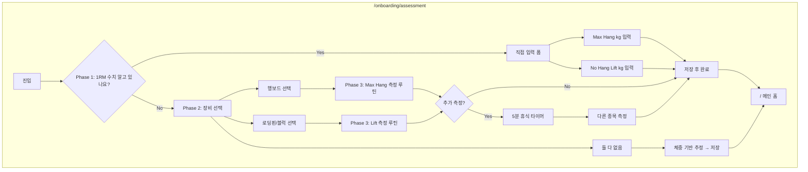

# ON-04: 수행 능력 측정 (Assessment) MVP 구현 계획

> **상태**: 계획 수립 (TODO 2.5)
> **관리 위치**: 이 문서는 `docs/implementation-plans/`에서 관리됩니다.

---

## 1. 요구사항 정리

| 출처             | 내용                                                                                                                                                                        |
| ---------------- | --------------------------------------------------------------------------------------------------------------------------------------------------------------------------- |
| PRD 3.1 [Step 3] | **Phase 1**: "1RM 수치를 이미 알고 있나요?" → Yes: Max Hang(kg) 또는 No Hang Lift(kg) 입력. No: Phase 2 이동.                                                               |
| PRD 3.1 [Step 3] | **Phase 2**: "보유 장비를 그림에서 선택해주세요." Option A 행보드(Max Hang), B 로딩핀/블럭(Lift), C 둘 다 없음(체중 기반 추정, Skip).                                       |
| PRD 3.1 [Step 3] | **Phase 3**: 장비 선택 시 측정 가이드 루틴 실행. **두 종목 모두 측정 시 종목 간 5분 강제 휴식 타이머.**                                                                     |
| TODO 2.5         | assessment 페이지, Phase 1~3, AssessmentForm, updateProfile.                                                                                                                |
| userflow         | 1RM 보유 → 입력 / 미보유 → 장비 선택 → 행보드→Max Hang, 로딩핀→Lift, 없음→체중 기반 추정 → 측정 완료 → 온보딩 완료 → 메인 홈.                                               |
| DB 스키마        | `setup_schema.sql`: profiles.max_hang_1rm, profiles.no_hang_lift_1rm, profiles.weight_kg. **실제 앱**: Clerk 연동으로 `users` 테이블 사용 → users에 동일 컬럼 추가 후 저장. |

**저장 정책**: 현재 온보딩 데이터는 모두 `users`(Clerk) 테이블에 저장됨. Assessment 결과도 `users`에 `weight_kg`, `max_hang_1rm`, `no_hang_lift_1rm` 컬럼을 추가한 뒤 동일하게 저장.

**진입 조건**: 티어 배정 완료 후 `/onboarding/tier-assign`에서 [다음] 클릭 시 `/onboarding/assessment`로 이동. 미로그인/티어 미완료 시 진입 시 리다이렉트 정책 적용 가능.

**디자인 레퍼런스**: `docs/design-refs/05_assessment.html`, `docs/ui_specs.md` ON-05. 톤은 02/03/04와 동일(다크 배경, primary 컬러).

---

## 2. 아키텍처 및 데이터 흐름

- **데이터 소스**: 현재 사용자 식별 후 `users` 테이블에 측정값 저장.
- **저장 payload**: `weight_kg?`, `max_hang_1rm?`, `no_hang_lift_1rm?` (선택적. 입력/측정한 항목만).
- **다음 단계**: 저장 성공 시 메인 홈(`/`)으로 이동.

---

## 3. 구현 범위 (TODO 2.5 기준)

### 3.1 DB 정책

- **users 테이블 확장** (마이그레이션):
  - `weight_kg float` (Nullable) — 체중. 추정 시 또는 추후 설정에서 사용.
  - `max_hang_1rm float` (Nullable) — Max Hang 1RM (kg).
  - `no_hang_lift_1rm float` (Nullable) — No Hang Lift 1RM (kg).
- `setup_schema.sql`의 `users` 정의에 위 컬럼 반영 (신규 설치 시 한 번에 적용).

### 3.2 라우트 및 페이지

- **파일**: `app/onboarding/assessment/page.tsx`
- **경로**: `/onboarding/assessment`
- **역할**: Phase 1 문답 → Phase 2 장비 선택(필요 시) → Phase 3 입력/측정/추정 → 저장 → 메인 홈 이동.

### 3.3 Phase별 UI/로직

| Phase               | 요소        | 구현 내용                                                                                       |
| ------------------- | ----------- | ----------------------------------------------------------------------------------------------- |
| Phase 1             | 문구        | "1RM 수치를 이미 알고 있나요?"                                                                  |
| Phase 1             | 버튼        | [네, 입력할게요] → 직접 입력 폼으로 전환. [아니요] → Phase 2로 전환.                            |
| Phase 1             | 입력 폼     | Max Hang (kg), No Hang Lift (kg) 숫자 입력. 각각 optional, 유효 범위 검증(예: 0.1~500).         |
| Phase 2             | 문구        | "보유 장비를 그림에서 선택해주세요."                                                            |
| Phase 2             | 카드 A      | 행보드 이미지 + 라벨 → 선택 시 Phase 3 Max Hang 측정 플로우.                                    |
| Phase 2             | 카드 B      | 로딩핀/블럭 이미지 + 라벨 → 선택 시 Phase 3 Lift 측정 플로우.                                   |
| Phase 2             | 카드 C      | "없음 / 모름" → 체중 기반 추정(또는 Skip) 후 저장 → 완료.                                       |
| Phase 3 (직접 입력) | [저장]      | 입력값으로 `updateAssessment` 호출 → 메인 홈.                                                   |
| Phase 3 (측정)      | 측정 가이드 | 장비별 측정 루틴 실행. (MVP에서 루틴 실행은 플레이어 연동 또는 간단 가이드 화면으로 대체 가능.) |
| Phase 3 (측정)      | 5분 휴식    | 두 종목 모두 측정 시, 첫 번째 측정 완료 후 5분 타이머 표시 후 두 번째 측정 진행.                |
| Phase 3 (추정)      | 체중 입력   | "둘 다 없음" 선택 시 체중(kg)만 입력받아 추정치 저장 또는 null 저장 후 완료.                    |

### 3.4 Server Actions

- **actions/profiles.ts** (또는 actions/onboarding.ts) 확장:
  - `updateAssessment(data: { weight_kg?: number; max_hang_1rm?: number; no_hang_lift_1rm?: number })`: 현재 사용자(clerk_id)의 `users` 테이블 해당 컬럼 업데이트.
  - 비로그인 시 `LOGIN_REQUIRED_MESSAGE` 반환.

### 3.5 컴포넌트

| 컴포넌트                                           | 역할                                                                                                           |
| -------------------------------------------------- | -------------------------------------------------------------------------------------------------------------- |
| **components/onboarding/AssessmentForm.tsx**       | Phase 1 문답, Phase 2 장비 카드, Phase 3 입력 폼/추정 폼. 단계 전환 UI, 숫자 입력 검증(react-hook-form + zod). |
| (선택) **components/onboarding/EquipmentCard.tsx** | 장비 선택 카드 한 개 (이미지 + 라벨 + 선택 상태).                                                              |
| (선택) **components/onboarding/RestTimer.tsx**     | 5분 휴식 타이머 표시 (두 종목 연속 측정 시).                                                                   |

### 3.6 데이터 구조

- **저장 payload**: `{ weight_kg?: number; max_hang_1rm?: number; no_hang_lift_1rm?: number }`. 단위 kg, 소수 허용.
- **검증**: 0 < value < 500 등 합리적 범위. 빈 값은 null로 저장 가능.

---

## 4. 파일별 작업 요약

| #   | 작업                                                               | 파일/위치                                                       |
| --- | ------------------------------------------------------------------ | --------------------------------------------------------------- |
| 1   | users 테이블에 weight_kg, max_hang_1rm, no_hang_lift_1rm 컬럼 추가 | supabase/migrations/                                            |
| 2   | setup_schema.sql의 users 정의에 위 컬럼 반영                       | supabase/migrations/setup_schema.sql                            |
| 3   | updateAssessment(data) 추가                                        | actions/profiles.ts                                             |
| 4   | AssessmentForm (Phase 1~3, 단계 전환, 입력/검증)                   | components/onboarding/AssessmentForm.tsx                        |
| 5   | assessment 페이지 (라우트, 진입 조건, 완료 시 / 이동)              | app/onboarding/assessment/page.tsx                              |
| 6   | (선택) 5분 휴식 타이머 컴포넌트                                    | components/onboarding/RestTimer.tsx                             |
| 7   | (선택) Phase 3 측정 가이드 루틴 실행                               | 플레이어 연동 또는 별도 가이드 화면 (MVP는 입력/추정 우선 가능) |

---

## 5. 기술적 유의사항

- **Phase 3 측정 실행**: PRD에는 "측정 가이드 루틴 실행"이 있으나, MVP에서 플레이어가 미구현일 수 있음. 이 경우 "직접 입력" + "장비 없음 → 추정/Skip"만 먼저 구현하고, 측정 실행은 "가이드 문구 + 나중에 입력" 또는 플레이어 구현 후 연동으로 단계적 확장.
- **체중 기반 추정**: "둘 다 없음" 선택 시 구체적 추정 공식은 별도 정의. MVP에서는 `weight_kg`만 저장하고 max_hang_1rm/no_hang_lift_1rm은 null로 두거나, 간단 추정치(예: weight_kg \* 계수) 저장.
- **5분 휴식**: 두 종목 모두 측정할 때만 적용. 타이머 UI는 간단 카운트다운(5:00 → 0:00) + 종료 후 다음 측정 버튼 활성화.
- **진입 조건**: 티어 배정 완료 사용자만 assessment 진입 허용 시, `getCurrentUserHomeGym`/티어 확인과 유사하게 `current_tier` 존재 여부로 검사 후 미완료 시 `/onboarding/tier-assign` 리다이렉트 가능.
- **디자인**: 05_assessment.html은 제목이 "Tier Assignment"로 되어 있어 Assessment 전용 레이아웃은 ui_specs ON-05 요소(탭, 입력 폼, 장비 카드)를 기준으로 구현.

---

## 6. 구현 순서 제안

1. **마이그레이션**: users에 weight_kg, max_hang_1rm, no_hang_lift_1rm 추가. setup_schema.sql 반영.
2. **actions/profiles.ts**: `updateAssessment(data)` 구현 (users 테이블 업데이트).
3. **AssessmentForm.tsx**: Phase 1 문답 + Phase 2 장비 카드(이미지 placeholder 가능) + Phase 3 직접 입력 폼 + "없음" 시 체중 입력/추정. 단계 state, 유효성 검사.
4. **assessment/page.tsx**: AssessmentForm 배치, 완료 시 updateAssessment 호출 후 router.push("/").
5. (선택) 5분 휴식 타이머: 두 종목 측정 플로우 시 RestTimer 표시.
6. (선택) Phase 3 실제 측정 루틴: 플레이어 또는 가이드 화면 연동.

---

## 7. 체크리스트 (TODO 2.5 대응)

- [x] 마이그레이션 — users.weight_kg, users.max_hang_1rm, users.no_hang_lift_1rm
- [x] setup_schema.sql — users 테이블에 위 컬럼 반영
- [x] `app/onboarding/assessment/page.tsx` — Phase 1~3, 완료 시 메인 홈 이동
- [x] `components/onboarding/AssessmentForm.tsx` — 탭/단계 전환, 숫자 입력 검증, 장비 선택 카드
- [x] `actions/profiles.ts` — updateAssessment(data), getCurrentUserTier()
- [ ] (선택) 두 종목 측정 시 5분 강제 휴식 타이머
- [ ] (선택) Phase 3 측정 루틴 실행(플레이어 연동)
