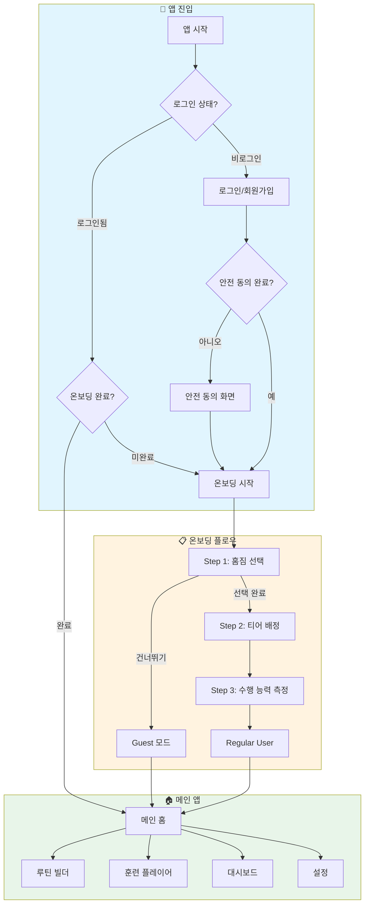
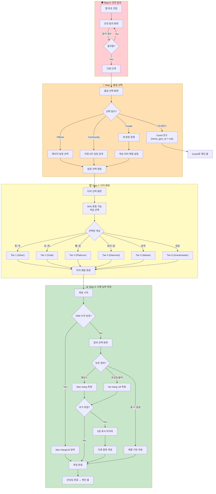
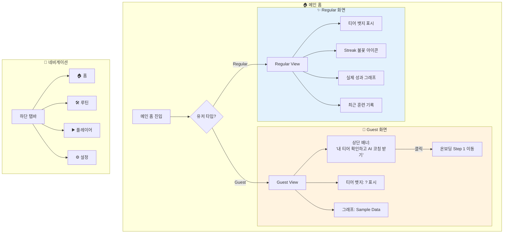
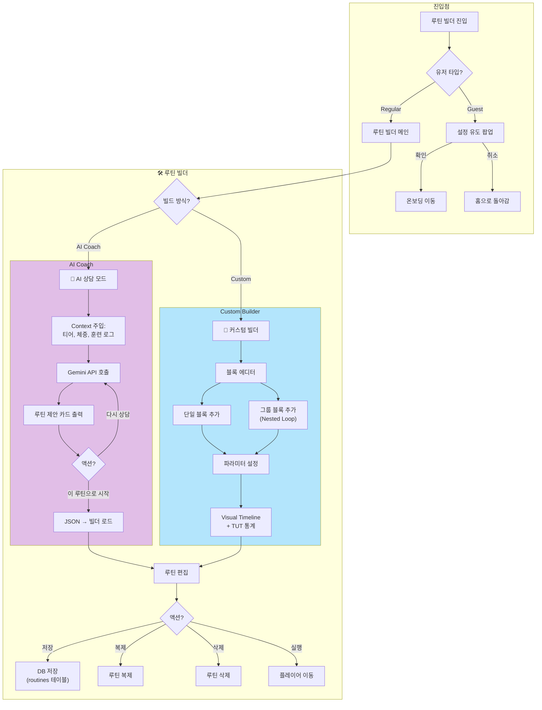
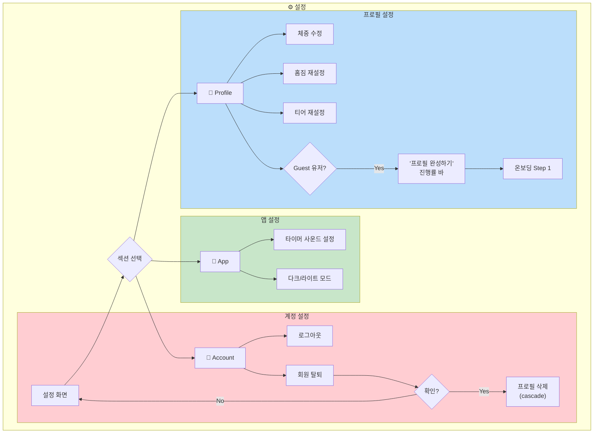
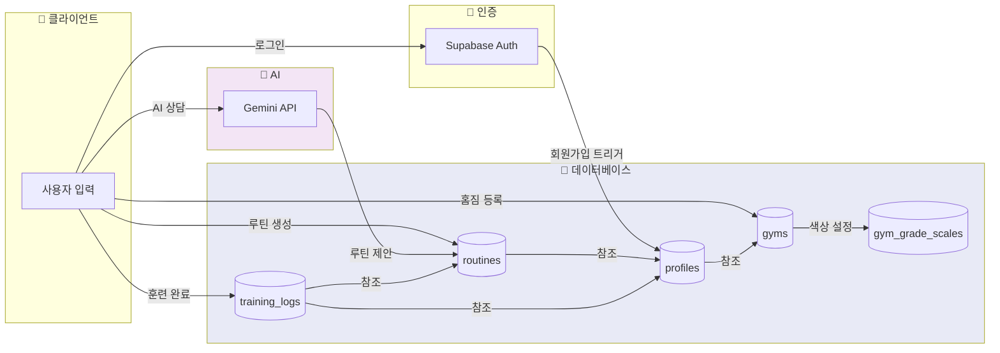
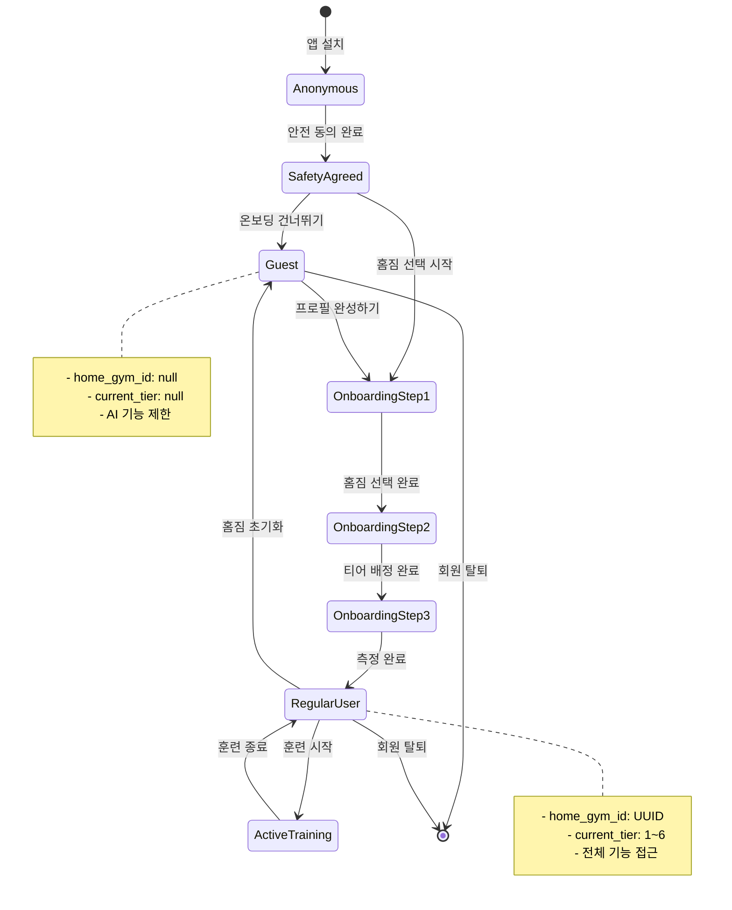
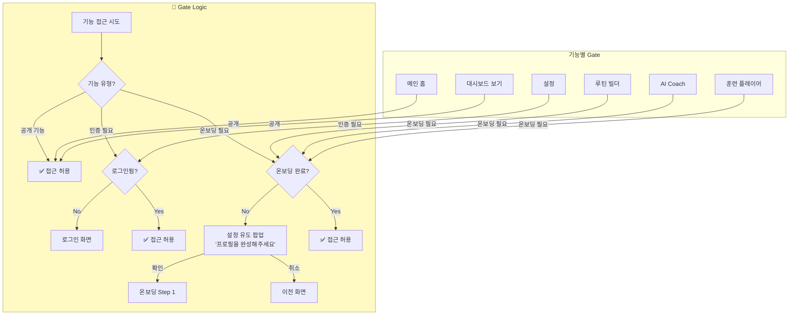

# GripLab 유저플로우 (User Flow)

> 이 문서는 GripLab 앱의 전체 사용자 흐름을 Mermaid 다이어그램으로 정의합니다.
>
> **Version**: v1.6
> **Last Updated**: 2026-02-03
> **기반 문서**: PRD.md, setup_schema.sql

---

## 1. 전체 앱 플로우 (Overview)



---

## 2. 온보딩 상세 플로우 (Onboarding Flow)



---

## 3. 메인 홈 & 대시보드 (Home Dashboard)



---

## 4. 루틴 빌더 플로우 (Routine Builder)



---

## 5. 훈련 플레이어 플로우 (Training Player)

```mermaid
flowchart TD
    subgraph Start["▶️ 훈련 시작"]
        A[루틴 선택] --> B[5초 Ready 카운트다운]
        B --> C{모드 선택}
    end

    subgraph TimerMode["⏱️ 타이머 모드 (Auto)"]
        C -->|Timer| D[운동 시작]
        D --> E["Start 사운드<br/>'삐-'"]
        E --> F[운동 진행]
        F --> G["End 사운드<br/>'삐-삐-'"]
        G --> H[휴식 시작]
        H --> I["Rest End 사운드<br/>'톡...톡...'"]
        I --> J{다음 세트?}
        J -->|Yes| D
        J -->|No| K[세션 종료]
    end

    subgraph LoggerMode["📝 로거 모드 (Manual)"]
        C -->|Logger| L[운동 시작]
        L --> M{수행 결과?}
        M -->|✅ 성공| N[다음 세트]
        M -->|⚠️ 절반| N
        M -->|❌ 실패| N
        N --> O{다음 세트?}
        O -->|Yes| L
        O -->|No| K
    end

    subgraph SessionEnd["🏁 세션 종료"]
        K --> P{종료 유형?}
        P -->|정상 완료| Q[RPE 입력 (1~10)]
        P -->|중단 Abort| R[중단 사유 선택]

        Q --> S["training_logs 저장<br/>status: 'completed'"]
        R --> T["training_logs 저장<br/>status: 'aborted'"]

        S --> U{기록 갱신?}
        T --> V[격려 메시지 출력]
        U -->|Yes| W[🎉 Confetti 애니메이션]
        U -->|No| X[결과 화면]
        W --> X
        V --> X

        X --> Y[메인 홈 이동]
    end

    style TimerMode fill:#c5cae9
    style LoggerMode fill:#dcedc8
    style SessionEnd fill:#ffe0b2
```

---

## 6. 설정 플로우 (Settings)



---

## 7. 데이터 플로우 (Data Flow)



---

## 8. 유저 상태 전이 다이어그램 (User State Transition)



---

## 9. Gate Logic (접근 제어)



---

## 변경 이력

| 버전 | 날짜       | 변경 내용                       |
| ---- | ---------- | ------------------------------- |
| v1.0 | 2026-02-03 | 초기 유저플로우 다이어그램 작성 |
